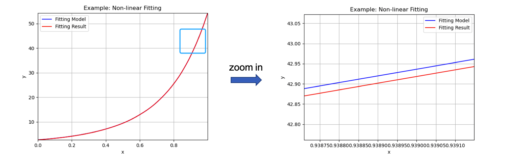
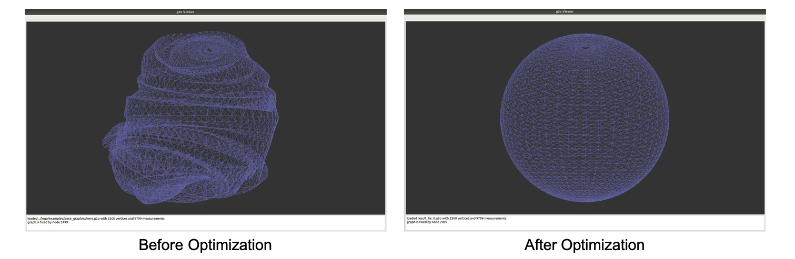

# LEGO #

**LEGO** is a **L**ight w**E**ight **G**raph-based **O**ptimization library in C++. It is a graph-based non-linear optimization framework for learning and practicing which only depends on Eigen3. This graph-based optimization library is designed for a generic purpose, and it is primarily targeted at visual or visual-inertial SLAM optimization problems in the backend. Now, the optimization problem solving in LEGO mainly depends on Levenberg-Marquardt algorithm with two updating strategies in the iterations and it will include more algorithms and updating strategies in the future, such as Dog-leg. This version is only tested on Ubuntu 18.04. 


## Installation ##

### Prerequisites

- **GCC** and [**CMake**](https://cmake.org/) 

- [**Eigen3**](http://eigen.tuxfamily.org/) 

  On Ubuntu 18.04, we can install CMake and Eigen3 following: 

  ```bash
  # cmake 
  sudo apt-get install gcc cmake 
  # Eigen3 
  sudo apt-get install libeigen3-dev 
  ```

### Build and Install 

We can build and install LEGO from this [repository](https://github.com/zha0ming1e/LEGO.git) and follow: 

```bash
git clone https://github.com/zha0ming1e/LEGO.git 
cd LEGO/ 
mkdir build/ 
cd build/ 
cmake .. && make -j6 
# if you want to install it 
sudo make install 
```

Now we have already installed the LEGO and then we can test and use it.

### Examples

There are two examples which are implemented by LEGO (one of non-linear data fitting and one of pose graph optimization on SE3/se3 with Lie group/algebra) under the [lego/examples/](./lego/examples/) folder.

- **Non-linear Data Fitting** 

  - **Default updating strategy** 

    **Run** 

    ```bash
    ./bin/example_nonlinear_fitting 0 
    ```

    **Output** 

    ```bash
    Example: Non-linear Fitting start... 
    ==========LEGO OPTIMIZER==========
    Iteration = 0,	Chi = 185454,	Lambda = 0.01
    Iteration = 1,	Chi = 153661,	Lambda = 6990.51
    Iteration = 2,	Chi = 62936.6,	Lambda = 18641.4
    Iteration = 3,	Chi = 27640.5,	Lambda = 12427.6
    Iteration = 4,	Chi = 1090.47,	Lambda = 4142.52
    Iteration = 5,	Chi = 546.72,	Lambda = 1380.84
    Iteration = 6,	Chi = 526.969,	Lambda = 460.28
    Iteration = 7,	Chi = 505.841,	Lambda = 153.427
    Iteration = 8,	Chi = 490.512,	Lambda = 51.1423
    Iteration = 9,	Chi = 487.068,	Lambda = 17.0474
    Iteration = 10,	Chi = 486.901,	Lambda = 5.68247
    Iteration = 11,	Chi = 486.9,	Lambda = 1.89416
    
    Stop the optimization: [last_chi_(486.9) - currentChi_(486.9) = 1.17714e-06] < 1e-5
    
    Info: 
    TimeCost(SolveProblem) = 8.30634 ms
    TimeCost(BuildHessian) = 6.29361 ms
    
    --------Estimates after optimization--------
    a, b, c = 0.98179, 2.0277, 0.989624
    --------Ground truth--------
    a, b, c = 1.0, 2.0, 1.0 
    ```

  - **Strategy 1** 

    **Run** 

    ```bash
    ./bin/example_nonlinear_fitting 1 
    ```

    **Output** 

    ```bash
    Example: Non-linear Fitting start... 
    ==========LEGO OPTIMIZER==========
    Iteration = 0,	Chi = 185454,	Lambda = 1e-05
    Iteration = 1,	Chi = 10190.1,	Lambda = 1.9684
    Iteration = 2,	Chi = 5286.38,	Lambda = 0.218711
    Iteration = 3,	Chi = 3595.03,	Lambda = 0.0243012
    Iteration = 4,	Chi = 1142.98,	Lambda = 0.00270014
    Iteration = 5,	Chi = 531.136,	Lambda = 0.000300015
    Iteration = 6,	Chi = 491.046,	Lambda = 3.3335e-05
    Iteration = 7,	Chi = 486.914,	Lambda = 3.70389e-06
    Iteration = 8,	Chi = 486.9,	Lambda = 4.11544e-07
    
    Stop the optimization: [last_chi_(486.9) - currentChi_(486.9) = 8.1672e-07] < 1e-5
    
    Info: 
    TimeCost(SolveProblem) = 6.86506 ms
    TimeCost(BuildHessian) = 5.41139 ms
    
    --------Estimates after optimization--------
    a, b, c = 0.98179, 2.0277, 0.989624
    --------Ground truth--------
    a, b, c = 1.0, 2.0, 1.0 
    ```
    
  - **Result** 

     

- **Pose Graph Optimization on SE3/se3** 

  (e.g. pose graph optimization on se3/Lie algebra with the default updating strategy) 

  **Run** 
  
  ```bash 
  ./bin/example_pose_graph_lie_algebra ./lego/examples/pose_graph/sphere.g2o 0 
  ```

  **Output** 
  
  ```bash
  Example: Pose Graph Optimization with Lie Algebra start...
  Read Total:
  VertexCount = 2500, EdgeCount = 9799
  Optimizing...
  ==========LEGO OPTIMIZER==========
  Iteration = 0,  Chi = 4.78072e+09,      Lambda = 20119.8
  Iteration = 1,  Chi = 3.13329e+08,      Lambda = 6706.59
  Iteration = 2,  Chi = 1.16618e+08,      Lambda = 2235.53
  Iteration = 3,  Chi = 7.13149e+07,      Lambda = 745.176
  Iteration = 4,  Chi = 4.21091e+07,      Lambda = 248.392
  Iteration = 5,  Chi = 2.10751e+07,      Lambda = 82.7973
  Iteration = 6,  Chi = 8.36379e+06,      Lambda = 27.5991
  Iteration = 7,  Chi = 3.09541e+06,      Lambda = 9.19971
  Iteration = 8,  Chi = 1.10012e+06,      Lambda = 3.06657
  Iteration = 9,  Chi = 367621,   Lambda = 1.02219
  Iteration = 10, Chi = 142505,   Lambda = 0.34073
  Iteration = 11, Chi = 85654.1,  Lambda = 0.185811
  Iteration = 12, Chi = 72762.7,  Lambda = 0.061937
  Iteration = 13, Chi = 71210.5,  Lambda = 0.0206457
  Iteration = 14, Chi = 68794.8,  Lambda = 0.00688189
  Iteration = 15, Chi = 65649.9,  Lambda = 0.00229396
  Iteration = 16, Chi = 64014.7,  Lambda = 0.000764654
  Iteration = 17, Chi = 63794.2,  Lambda = 0.000254885
  Iteration = 18, Chi = 63789.1,  Lambda = 8.49616e-05
  Iteration = 19, Chi = 63789.1,  Lambda = 2.83205e-05
  
  Stop the optimization: [last_chi_(63789.1) - currentChi_(63789.1) = 5.42382e-06] < 1e-05
  
  Info:
  TimeCost(SolveProblem) = 1.17305e+07 ms
  TimeCost(BuildHessian) = 18156.1 ms
  
  Saving optimization results... 
  ```
  
  **Result** 
  
   
  
    

### Uninstall

We can delete the LEGO header files (\*.h/\*.hpp) and libs (\*.so) from where we installed it. Default: 

```bash
# headers 
sudo rm -rf /usr/local/include/lego/ 
# libs 
sudo rm -rf /usr/local/lib/liblego_* 
```


## References ## 

- [**g2o**](https://github.com/RainerKuemmerle/g2o): A General Framework for Graph Optimization 
- [**ceres-solver**](http://ceres-solver.org/): A Large Scale Non-linear Optimization Library 

- [**Sophus**](https://github.com/strasdat/Sophus): C++ implementation of Lie Groups using Eigen 
- [**VINS-Mono**](https://github.com/HKUST-Aerial-Robotics/VINS-Mono): A Robust and Versatile Monocular Visual-Inertial State Estimator 
- [**VINS-Course**](https://github.com/HeYijia/VINS-Course): VINS-Mono code without Ceres or ROS 
- [**Gavin, H.. “The Levenberg-Marquardt method for nonlinear least squares curve-fitting problems c ©.” (2013).**](http://people.duke.edu/~hpgavin/ce281/lm.pdf) 

